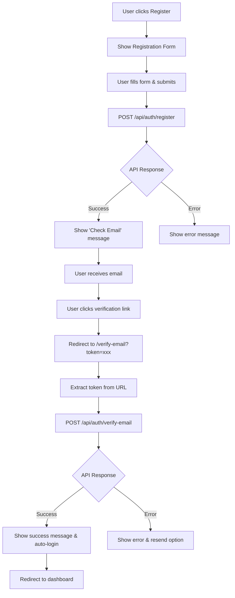

# Email Verification Frontend Implementation Guide

## Overview

This guide provides complete instructions for implementing email verification on the frontend to work with the JobPsych Auth API's email verification system.

## User Flow

### Complete Registration & Verification Flow



## Frontend Implementation Steps

### 1. Registration Form Updates

#### Update Registration Component

```typescript
// RegistrationForm.tsx
import { useState } from "react";
import { useNavigate } from "react-router-dom";

const RegistrationForm = () => {
  const [formData, setFormData] = useState({
    name: "",
    email: "",
    password: "",
    company_name: "",
  });
  const [isLoading, setIsLoading] = useState(false);
  const [message, setMessage] = useState("");
  const [requiresVerification, setRequiresVerification] = useState(false);
  const navigate = useNavigate();

  const handleSubmit = async (e: React.FormEvent) => {
    e.preventDefault();
    setIsLoading(true);
    setMessage("");

    try {
      const response = await fetch("/api/auth/register", {
        method: "POST",
        headers: {
          "Content-Type": "application/json",
        },
        body: JSON.stringify(formData),
      });

      const data = await response.json();

      if (response.ok) {
        setRequiresVerification(true);
        setMessage(
          "Registration successful! Please check your email to verify your account."
        );
      } else {
        setMessage(data.error || "Registration failed");
      }
    } catch (error) {
      setMessage("Network error. Please try again.");
    } finally {
      setIsLoading(false);
    }
  };

  if (requiresVerification) {
    return (
      <div className="verification-pending">
        <h2>Check Your Email</h2>
        <p>{message}</p>
        <p>
          We've sent a verification link to <strong>{formData.email}</strong>
        </p>
        <button onClick={() => navigate("/login")}>Go to Login</button>
      </div>
    );
  }

  return (
    <form onSubmit={handleSubmit}>
      {/* Form fields */}
      <input
        type="text"
        placeholder="Full Name"
        value={formData.name}
        onChange={(e) => setFormData({ ...formData, name: e.target.value })}
        required
      />
      <input
        type="email"
        placeholder="Email"
        value={formData.email}
        onChange={(e) => setFormData({ ...formData, email: e.target.value })}
        required
      />
      <input
        type="password"
        placeholder="Password"
        value={formData.password}
        onChange={(e) => setFormData({ ...formData, password: e.target.value })}
        required
      />
      <input
        type="text"
        placeholder="Company Name"
        value={formData.company_name}
        onChange={(e) =>
          setFormData({ ...formData, company_name: e.target.value })
        }
        required
      />
      <button type="submit" disabled={isLoading}>
        {isLoading ? "Registering..." : "Register"}
      </button>
      {message && <p className="message">{message}</p>}
    </form>
  );
};
```

### 2. Email Verification Component

#### Create Email Verification Page

```typescript
// VerifyEmail.tsx
import { useEffect, useState } from "react";
import { useNavigate, useSearchParams } from "react-router-dom";

const VerifyEmail = () => {
  const [searchParams] = useSearchParams();
  const [status, setStatus] = useState<"loading" | "success" | "error">(
    "loading"
  );
  const [message, setMessage] = useState("");
  const navigate = useNavigate();

  useEffect(() => {
    const token = searchParams.get("token");

    if (!token) {
      setStatus("error");
      setMessage("Verification token is missing from the URL.");
      return;
    }

    verifyEmail(token);
  }, [searchParams]);

  const verifyEmail = async (token: string) => {
    try {
      const response = await fetch("/api/auth/verify-email", {
        method: "POST",
        headers: {
          "Content-Type": "application/json",
        },
        body: JSON.stringify({ token }),
      });

      const data = await response.json();

      if (response.ok) {
        setStatus("success");
        setMessage("Email verified successfully! You are now logged in.");

        // Store tokens if needed
        if (data.data?.accessToken) {
          localStorage.setItem("accessToken", data.data.accessToken);
          // Redirect to dashboard after 2 seconds
          setTimeout(() => navigate("/dashboard"), 2000);
        }
      } else {
        setStatus("error");
        setMessage(data.error || "Email verification failed.");
      }
    } catch (error) {
      setStatus("error");
      setMessage("Network error. Please try again.");
    }
  };

  return (
    <div className="verify-email-page">
      {status === "loading" && (
        <div className="loading">
          <h2>Verifying Your Email...</h2>
          <div className="spinner"></div>
        </div>
      )}

      {status === "success" && (
        <div className="success">
          <h2>✅ Email Verified!</h2>
          <p>{message}</p>
          <p>Redirecting to dashboard...</p>
        </div>
      )}

      {status === "error" && (
        <div className="error">
          <h2>❌ Verification Failed</h2>
          <p>{message}</p>
          <div className="actions">
            <button onClick={() => navigate("/resend-verification")}>
              Resend Verification Email
            </button>
            <button onClick={() => navigate("/login")}>Go to Login</button>
          </div>
        </div>
      )}
    </div>
  );
};
```

### 3. Resend Verification Component

#### Create Resend Verification Page

```typescript
// ResendVerification.tsx
import { useState } from "react";
import { useNavigate } from "react-router-dom";

const ResendVerification = () => {
  const [email, setEmail] = useState("");
  const [isLoading, setIsLoading] = useState(false);
  const [message, setMessage] = useState("");
  const navigate = useNavigate();

  const handleSubmit = async (e: React.FormEvent) => {
    e.preventDefault();
    setIsLoading(true);
    setMessage("");

    try {
      const response = await fetch("/api/auth/resend-verification", {
        method: "POST",
        headers: {
          "Content-Type": "application/json",
        },
        body: JSON.stringify({ email }),
      });

      const data = await response.json();

      if (response.ok) {
        setMessage(
          "Verification email sent successfully! Please check your email."
        );
      } else {
        setMessage(data.error || "Failed to send verification email.");
      }
    } catch (error) {
      setMessage("Network error. Please try again.");
    } finally {
      setIsLoading(false);
    }
  };

  return (
    <div className="resend-verification">
      <h2>Resend Verification Email</h2>
      <p>
        Enter your email address and we'll send you a new verification link.
      </p>

      <form onSubmit={handleSubmit}>
        <input
          type="email"
          placeholder="Enter your email"
          value={email}
          onChange={(e) => setEmail(e.target.value)}
          required
        />
        <button type="submit" disabled={isLoading}>
          {isLoading ? "Sending..." : "Send Verification Email"}
        </button>
      </form>

      {message && <p className="message">{message}</p>}

      <button onClick={() => navigate("/login")} className="back-to-login">
        Back to Login
      </button>
    </div>
  );
};
```

### 4. Login Form Updates

#### Update Login Component for Unverified Users

```typescript
// LoginForm.tsx
const LoginForm = () => {
  const [formData, setFormData] = useState({
    email: "",
    password: "",
  });
  const [isLoading, setIsLoading] = useState(false);
  const [message, setMessage] = useState("");
  const navigate = useNavigate();

  const handleSubmit = async (e: React.FormEvent) => {
    e.preventDefault();
    setIsLoading(true);
    setMessage("");

    try {
      const response = await fetch("/api/auth/login", {
        method: "POST",
        headers: {
          "Content-Type": "application/json",
        },
        body: JSON.stringify(formData),
      });

      const data = await response.json();

      if (response.ok) {
        // Store tokens
        localStorage.setItem("accessToken", data.data.accessToken);
        navigate("/dashboard");
      } else if (response.status === 403 && data.requiresVerification) {
        // Email not verified
        setMessage("Please verify your email address before logging in.");
        // Optionally redirect to resend verification
        setTimeout(() => navigate("/resend-verification"), 2000);
      } else {
        setMessage(data.error || "Login failed");
      }
    } catch (error) {
      setMessage("Network error. Please try again.");
    } finally {
      setIsLoading(false);
    }
  };

  return (
    <form onSubmit={handleSubmit}>
      <input
        type="email"
        placeholder="Email"
        value={formData.email}
        onChange={(e) => setFormData({ ...formData, email: e.target.value })}
        required
      />
      <input
        type="password"
        placeholder="Password"
        value={formData.password}
        onChange={(e) => setFormData({ ...formData, password: e.target.value })}
        required
      />
      <button type="submit" disabled={isLoading}>
        {isLoading ? "Logging in..." : "Login"}
      </button>
      {message && <p className="message">{message}</p>}

      <div className="links">
        <a href="/register">Don't have an account? Register</a>
        <a href="/resend-verification">Didn't receive verification email?</a>
      </div>
    </form>
  );
};
```

### 5. Route Configuration

#### Update Router Configuration

```typescript
// App.tsx or router configuration
import { BrowserRouter, Routes, Route } from "react-router-dom";
import RegistrationForm from "./components/RegistrationForm";
import LoginForm from "./components/LoginForm";
import VerifyEmail from "./components/VerifyEmail";
import ResendVerification from "./components/ResendVerification";
import Dashboard from "./components/Dashboard";

function App() {
  return (
    <BrowserRouter>
      <Routes>
        <Route path="/register" element={<RegistrationForm />} />
        <Route path="/login" element={<LoginForm />} />
        <Route path="/verify-email" element={<VerifyEmail />} />
        <Route path="/resend-verification" element={<ResendVerification />} />
        <Route path="/dashboard" element={<Dashboard />} />
        {/* Other routes */}
      </Routes>
    </BrowserRouter>
  );
}
```

### 6. API Integration Helper

#### Create API Helper Functions

```typescript
// api/auth.ts
const API_BASE = "/api/auth";

export const authAPI = {
  register: async (userData: {
    name: string;
    email: string;
    password: string;
    company_name: string;
  }) => {
    const response = await fetch(`${API_BASE}/register`, {
      method: "POST",
      headers: { "Content-Type": "application/json" },
      body: JSON.stringify(userData),
    });
    return response.json();
  },

  login: async (credentials: { email: string; password: string }) => {
    const response = await fetch(`${API_BASE}/login`, {
      method: "POST",
      headers: { "Content-Type": "application/json" },
      body: JSON.stringify(credentials),
    });
    return response.json();
  },

  verifyEmail: async (token: string) => {
    const response = await fetch(`${API_BASE}/verify-email`, {
      method: "POST",
      headers: { "Content-Type": "application/json" },
      body: JSON.stringify({ token }),
    });
    return response.json();
  },

  resendVerification: async (email: string) => {
    const response = await fetch(`${API_BASE}/resend-verification`, {
      method: "POST",
      headers: { "Content-Type": "application/json" },
      body: JSON.stringify({ email }),
    });
    return response.json();
  },

  refreshToken: async () => {
    const response = await fetch(`${API_BASE}/refresh`, {
      method: "POST",
      credentials: "include", // For HttpOnly cookies
    });
    return response.json();
  },
};
```

### 7. Authentication Context/Hook

#### Update Auth Context for Email Verification

```typescript
// contexts/AuthContext.tsx
import { createContext, useContext, useState, useEffect } from "react";

interface User {
  id: string;
  name: string;
  email: string;
  company_name: string;
  emailVerified: boolean;
}

interface AuthContextType {
  user: User | null;
  login: (email: string, password: string) => Promise<void>;
  logout: () => void;
  isLoading: boolean;
}

const AuthContext = createContext<AuthContextType | undefined>(undefined);

export const AuthProvider = ({ children }: { children: React.ReactNode }) => {
  const [user, setUser] = useState<User | null>(null);
  const [isLoading, setIsLoading] = useState(true);

  useEffect(() => {
    // Check if user is logged in on app start
    checkAuthStatus();
  }, []);

  const checkAuthStatus = async () => {
    const token = localStorage.getItem("accessToken");
    if (token) {
      // Validate token with backend or decode locally
      // For now, assume token is valid
      setUser({
        /* user data from token */
      });
    }
    setIsLoading(false);
  };

  const login = async (email: string, password: string) => {
    const response = await authAPI.login({ email, password });

    if (response.success) {
      localStorage.setItem("accessToken", response.data.accessToken);
      setUser(response.data.user);
    } else {
      throw new Error(response.error);
    }
  };

  const logout = () => {
    localStorage.removeItem("accessToken");
    setUser(null);
  };

  return (
    <AuthContext.Provider value={{ user, login, logout, isLoading }}>
      {children}
    </AuthContext.Provider>
  );
};

export const useAuth = () => {
  const context = useContext(AuthContext);
  if (context === undefined) {
    throw new Error("useAuth must be used within an AuthProvider");
  }
  return context;
};
```

## Error Handling

### Common Error Scenarios

```typescript
// Error handling utility
const handleAuthError = (error: any) => {
  if (
    error.response?.status === 403 &&
    error.response?.data?.requiresVerification
  ) {
    // Redirect to resend verification
    navigate("/resend-verification");
    return "Please verify your email address first.";
  }

  if (
    error.response?.status === 400 &&
    error.response?.data?.message === "Token expired"
  ) {
    // Redirect to resend verification
    navigate("/resend-verification");
    return "Verification link has expired. We sent you a new one.";
  }

  return error.response?.data?.error || "An error occurred";
};
```

## UI/UX Considerations

### Loading States

- Show spinner during API calls
- Disable buttons during submission
- Provide clear feedback for each state

### Error Messages

- Clear, actionable error messages
- Specific guidance for next steps
- Links to relevant pages (resend verification, login, etc.)

### Success States

- Clear success confirmation
- Automatic redirects where appropriate
- Progress indicators for multi-step processes

### Email Verification Flow

- Clear instructions in emails
- Fallback options (copy/paste links)
- Expiration warnings
- Easy resend functionality

## Testing the Integration

### Manual Testing Checklist

1. **Registration Flow**

   - [ ] Submit registration form
   - [ ] Receive "check email" message
   - [ ] Email arrives with verification link
   - [ ] Click link redirects to verification page
   - [ ] Verification succeeds and auto-logs in

2. **Login with Unverified Account**

   - [ ] Try to login with unverified account
   - [ ] Receive "verify email" error
   - [ ] Redirect to resend verification page

3. **Resend Verification**

   - [ ] Submit email for resend
   - [ ] Receive success message
   - [ ] New email arrives

4. **Token Expiration**
   - [ ] Use expired verification link
   - [ ] Receive expiration error
   - [ ] Can request new verification email

## Security Considerations

### Frontend Security

- Never store sensitive data in localStorage
- Use HttpOnly cookies for refresh tokens
- Validate tokens on protected routes
- Clear tokens on logout

### Email Security

- Verification links expire (24 hours)
- Tokens are single-use
- No sensitive data in email links
- HTTPS required for production

## Deployment Checklist

- [ ] Configure SMTP settings in production
- [ ] Set correct FRONTEND_URL for email links
- [ ] Enable HTTPS for secure email links
- [ ] Test email delivery in production environment
- [ ] Monitor email bounce rates and delivery issues
- [ ] Set up email analytics if needed

## Troubleshooting

### Common Issues

1. **Emails not arriving**

   - Check SMTP configuration
   - Verify firewall settings
   - Check spam folder
   - Test with different email providers

2. **Verification links not working**

   - Check FRONTEND_URL configuration
   - Ensure HTTPS in production
   - Verify token encoding/decoding

3. **CORS issues**

   - Add frontend domain to CORS_ORIGINS
   - Check preflight request handling

4. **Token expiration**
   - Check VERIFICATION_EXPIRY setting
   - Implement automatic resend functionality

This implementation provides a complete, secure, and user-friendly email verification system for your JobPsych application.
