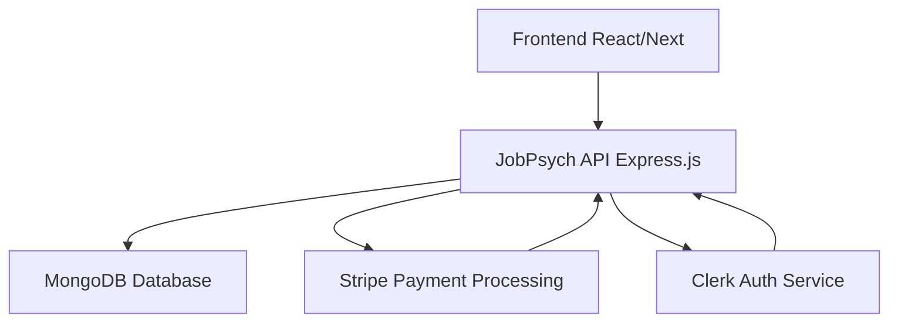

# JobPsych Payment & Subscription API - Complete Workflow

## 📋 Overview

JobPsych is a comprehensive payment and subscription management system that integrates Clerk authentication, Stripe payment processing, and MongoDB data storage. This document outlines the complete workflow from user registration to subscription management.

## 🏗️ System Architecture



## 🔄 Complete User Journey

### Phase 1: User Registration & Authentication

#### 1.1 User Signs Up via Clerk

```text
User Action: Sign up/Login on JobPsych frontend using Clerk
↓
Clerk Service: Creates user account and generates unique clerk_id
↓
Clerk Webhook: Sends 'user.created' event to JobPsych API
```

#### 1.2 Webhook Processing

```text
POST /api/webhooks/clerk
↓
handleClerkWebhook() processes the event
↓
handleUserCreated() function:
  - Extracts user data (email, name, clerk_id)
  - Creates Stripe customer with Clerk metadata
  - Creates user record in MongoDB
  - Sets default plan to 'free'
```

#### 1.3 Database Storage

```javascript
User Document Created:
{
  _id: ObjectId(...),
  email: "user@example.com",
  name: "John Doe",
  clerk_id: "user_2abc123def456",
  stripe_customer_id: "cus_1234567890",
  plan_type: "free",
  subscription_status: "inactive",
  created_at: ISODate(...),
  updated_at: ISODate(...)
}
```

### Phase 2: Subscription Management

#### 2.1 Plan Selection

```text
User selects plan on frontend:
- Free: $0/month (up to 2 resumes)
- Pro: $50/month (unlimited resumes)
- Premium: Contact for pricing
```

#### 2.2 Payment Processing Flow

##### Free Plan Subscription

```text
POST /api/subscription
Body: { plan: "free", customer_email, customer_name }
↓
createPlanPayment() validates request
↓
Checks if user exists in MongoDB
↓
Updates user plan_type to "free"
↓
Sets subscription_status to "active"
↓
Returns success response (no payment required)
```

##### Pro Plan Subscription

```text
POST /api/subscription
Body: { plan: "pro", customer_email, customer_name }
↓
createPlanPayment() validates request
↓
Creates Stripe PaymentIntent for $50
↓
Returns client_secret for frontend payment
↓
Frontend confirms payment with Stripe
```

#### 2.3 Payment Confirmation

```text
Stripe Webhook: payment_intent.succeeded
↓
POST /api/webhooks/stripe
↓
handleStripeWebhook() processes payment
↓
Updates user subscription_status to "active"
↓
Updates plan_type to "pro"
↓
Stores subscription details in MongoDB
```

### Phase 3: User Data Retrieval

#### 3.1 Get User by Clerk ID

```text
GET /api/users/clerk/:clerkId
↓
getUserByClerkId() function
↓
Queries MongoDB: { clerk_id: clerkId }
↓
Returns user data with subscription status
```

#### 3.2 Get User by Email

```text
GET /api/users/email/:email
↓
getUserByEmail() function
↓
Queries MongoDB: { email: email.toLowerCase() }
↓
Returns user data with subscription status
```

#### 3.3 Get User by ID

```text
GET /api/users/:id
↓
getUserById() function
↓
Queries MongoDB by ObjectId
↓
Returns user data with subscription status
```

## 🔧 API Endpoints Overview

### Authentication & User Management

```
POST   /api/webhooks/clerk     - Handle Clerk authentication events
GET    /api/users/clerk/:id    - Get user by Clerk ID
GET    /api/users/email/:email - Get user by email
GET    /api/users/:id          - Get user by database ID
PUT    /api/users/:id          - Update user information
POST   /api/users              - Create user (with Clerk ID)
```

### Subscription & Payment

```
GET    /api/                   - Get available plans and pricing
POST   /api/subscription       - Create subscription/payment
GET    /api/subscription/:id   - Get payment status
POST   /api/subscription/store - Store subscription data
POST   /api/webhooks/stripe    - Handle Stripe payment webhooks
```

### System Health

```
GET    /                      - API status and documentation
GET    /health                - Health check endpoint
GET    /api                   - Simplified API documentation
```

## 💳 Payment Flow Details

### Stripe Integration

1. **Customer Creation**: Automatic when user signs up via Clerk
2. **Payment Methods**: Card payments via Stripe Elements
3. **Webhooks**: Real-time payment status updates
4. **Subscription Management**: Monthly recurring payments for Pro plan

### Supported Plans

```javascript
const PLANS = {
  free: {
    price: 0,
    features: ["Up to 2 resume uploads", "Basic features"],
    resumeLimit: 2,
  },
  pro: {
    price: 50, // $50/month
    features: ["Unlimited resumes", "Advanced features"],
    resumeLimit: -1, // unlimited
  },
  premium: {
    price: "Contact required",
    features: ["Custom features", "Priority support"],
  },
};
```

## 🔐 Security & Authentication

### Clerk Integration

- **JWT Tokens**: Secure authentication via Clerk
- **Webhook Verification**: Validates incoming webhook signatures
- **User Management**: Centralized user data with Clerk
- **Social Login**: Support for multiple authentication providers

### Data Protection

- **HTTPS Only**: All communications encrypted
- **Input Validation**: Comprehensive request validation
- **Error Handling**: Secure error responses without data leakage
- **CORS Configuration**: Restricted to allowed origins

## 📊 Database Schema

### User Collection

```javascript
{
  _id: ObjectId,
  email: String (unique, lowercase),
  name: String,
  clerk_id: String (unique, required),
  stripe_customer_id: String (required),
  plan_type: String (enum: ['free', 'pro', 'premium']),
  subscription_status: String (enum: ['active', 'inactive', 'cancelled']),
  created_at: Date,
  updated_at: Date
}
```

### Subscription Collection (if implemented)

```javascript
{
  _id: ObjectId,
  user_id: ObjectId,
  stripe_subscription_id: String,
  plan_type: String,
  status: String,
  current_period_start: Date,
  current_period_end: Date,
  created_at: Date,
  updated_at: Date
}
```

## 🚀 Deployment & Scaling

### Environment Setup

```bash
# Required Environment Variables
CLERK_PUBLISHABLE_KEY=pk_test_...
CLERK_SECRET_KEY=sk_test_...
STRIPE_SECRET_KEY=sk_test_...
MONGODB_URI=mongodb://localhost:27017/jobpsych
PORT=5000
```

### Docker Deployment

```dockerfile
# Multi-stage build for optimization
FROM node:18-alpine AS builder
WORKDIR /app
COPY package*.json ./
RUN npm ci --only=production

FROM node:18-alpine AS runner
WORKDIR /app
COPY --from=builder /app/node_modules ./node_modules
COPY . .
EXPOSE 5000
CMD ["npm", "start"]
```

### CI/CD Pipeline

- **GitHub Actions**: Automated testing and deployment
- **Docker Hub**: Container image publishing
- **Vercel**: Frontend deployment
- **MongoDB Atlas**: Cloud database hosting

## 🔍 Monitoring & Logging

### Application Logs

- **Morgan Middleware**: HTTP request logging
- **Error Handling**: Comprehensive error logging
- **Webhook Events**: Detailed webhook processing logs
- **Payment Events**: Stripe webhook event logging

### Health Checks

```javascript
GET /health
Response: {
  status: "OK",
  service: "payment-service",
  uptime: 1234.567,
  timestamp: "2025-09-03T10:00:00.000Z"
}
```

## 🧪 Testing Strategy

### API Testing

- **Postman Collections**: Comprehensive API testing
- **Webhook Testing**: Stripe CLI for webhook simulation
- **Unit Tests**: Controller and middleware testing
- **Integration Tests**: End-to-end payment flow testing

### Test Scenarios

1. User registration via Clerk webhook
2. Free plan subscription (no payment)
3. Pro plan payment processing
4. Payment webhook handling
5. User data retrieval by Clerk ID
6. Subscription status updates

## 📈 Future Enhancements

### Planned Features

- **Premium Plan**: Custom pricing and enterprise features
- **Usage Tracking**: Resume upload limits and analytics
- **Billing Portal**: Self-service subscription management
- **Multi-currency**: Support for international payments
- **Webhook Retries**: Failed webhook retry mechanism
- **Audit Logs**: Comprehensive user action tracking

### Scalability Improvements

- **Redis Caching**: User session and plan data caching
- **Rate Limiting**: API request rate limiting
- **Load Balancing**: Multiple server instances
- **Database Sharding**: Horizontal scaling for user data

## 🆘 Troubleshooting

### Common Issues

1. **Webhook Failures**: Check webhook endpoint URLs in Stripe/Clerk dashboards
2. **Payment Declines**: Verify Stripe API keys and customer data
3. **User Not Found**: Ensure Clerk webhooks are properly configured
4. **Database Connection**: Verify MongoDB connection string

### Debug Commands

```bash
# Check application logs
npm run dev

# Test webhook endpoints
curl -X POST http://localhost:5000/api/webhooks/clerk \
  -H "Content-Type: application/json" \
  -d '{"type":"user.created","data":{...}}'

# Health check
curl http://localhost:5000/health
```

---

## 📞 Support & Documentation

For additional support or questions about the JobPsych Payment API workflow:

- **API Documentation**: Visit `/api` endpoint for detailed endpoint information
- **Testing Guide**: Refer to `TESTING_GUIDE.md` for comprehensive testing instructions
- **GitHub Issues**: Report bugs and feature requests
- **Webhook Logs**: Monitor application logs for webhook processing details

_Last Updated: September 3, 2025_</content>
<parameter name="filePath">d:\Development\Projects\deployment\JobPsych\jobpsych\payment\WORKFLOW.md
